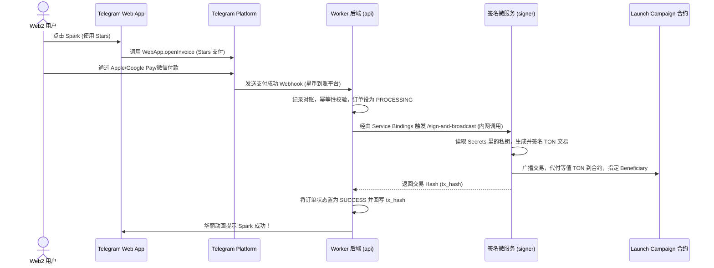

# VibeCoder 3.0: 极简低门槛、病毒裂变与代币深度捆绑的系统级升级方案

作为加密行业的资深产品经理，在深度审计与梳理了当前项目的智能合约（`contracts/`）、前端（`vc/`）以及后端 Worker 服务（`worker/`）的架构与代码实现后，我认为当前系统具备良好的技术底座，但在**用户与项目方操作门槛、社交病毒式传播、以及平台代币 $VC 与生态的价值绑定**上，仍带有较重的 Web3 极客属性，难以实现真正的傻瓜化操作与爆发式增长。

以下是针对当前代码库的系统级调整方案（**只给方案，不修改任何源文件**）。

---

## 1. 可以去除的模块（降噪与减负：剔除高门槛、低效率逻辑）

为了让用户和项目方实现“傻瓜式操作”，我们应当精简那些增加认知负荷和操作摩擦的 Web3 特性：

### 1.1 保留充值入金板块，改为 UID 自动验证 + 链上入账验证
*   **代码对应位置**：
    *   前端：[OnRampPage.tsx](file:///Users/yudeyou/Desktop/VC/vc/src/pages/OnRampPage.tsx) 应继续作为普通 VibeCoder 用户进入加密行业的“充值入金入门页”，提供交易所注册、C2C 买币、TON/USDT 提现到自托管钱包、风险提醒和操作教程。
    *   前端：[BountyPage.tsx](file:///Users/yudeyou/Desktop/VC/vc/src/pages/BountyPage.tsx) 中和交易所截图奖励强绑定的任务入口需要降级，不再作为主增长激励。
    *   后端：[index.ts](file:///Users/yudeyou/Desktop/VC/worker/src/index.ts) 中处理 `EXCHANGE_REG` 的接口保留，但应调整为低额度、限频、风控化的“新手完成度记录”，而不是可大规模发放 VC 的核心奖励通道。
    *   数据库：[0006_bounty_exchange.sql](file:///Users/yudeyou/Desktop/VC/worker/migrations/0006_bounty_exchange.sql) 中的 `exchange_uid` 和 `screenshot_url` 字段保留用于历史记录与人工抽查，不应删除。
*   **调整理由**：充值入金是 Web2 用户进入 TON / VibeCoder 的必要桥梁，不能去除。真正需要降低的是“截图审核换奖励”的欺诈风险和运营成本，而不是入金教程本身。
*   **更优方案**：将 OnRamp 从“赏金截图任务”重构为 **Crypto Starter 入门中心**：
    1.  **保留入口**：导航中继续保留“充值入金 / 新手入门”，服务普通开发者完成从法币到 TON 钱包的第一步。
    2.  **教程化**：拆成“选择交易所 → 完成 KYC/C2C → 提币到 Tonkeeper/Telegram Wallet → 回到 VibeCoder Spark”的步骤卡，每步只解释用户必须理解的动作和风险。
    3.  **安全提示**：强调官方链接、域名校验、小额试转、不要向任何人泄露助记词、不代客买币、不承诺收益。
    4.  **邀请码 UID 自动验证**：用户通过 VibeCoder 官方邀请码/邀请链接注册交易所后，只需在平台填写交易所 UID。平台通过交易所 Affiliate / Broker API 查询该 UID 是否属于 VibeCoder 邀请关系，并校验可获得的数据项，例如注册时间、KYC 状态、首次入金、首次交易或首次提币。用户绝不上传自己的交易所 API Key。
    5.  **链上入账验证**：用户绑定 TON 钱包后，平台监听该钱包在完成 UID 绑定之后是否出现 TON / USDT 入账，尤其是来自交易所热钱包或用户声明的提币交易。只有“UID 归因成立 + 钱包出现链上入账 + 完成一次有效 Spark / 余额保持”后，才标记 OnRamp 完成。
    6.  **人工兜底**：截图不再是默认验证路径，只保留为申诉材料或风控抽查证据。交易所 API 不稳定、UID 查询失败、链上来源无法识别时，用户可提交截图进入人工复核队列，奖励先冻结不自动发放。
    7.  **奖励降级与风控**：OnRamp 奖励定位为低额度新手完成奖励，例如徽章、少量 VC 或积分；必须限制每钱包/Telegram 账号/设备/交易所 UID 只领取一次，并结合 IP、设备指纹、钱包历史、提现金额和 Spark 行为做风险评分。
    8.  **与 Stars 并存**：Telegram Stars 支付桥是更低门槛的补充路径，但不能完全替代充值入金板块。Stars 适合小额试用，交易所入金适合用户真正进入加密资产体系。

### 1.2 去除日常里程碑的复杂 DAO 投票表决
*   **代码对应位置**：
    *   合约：`governance.tolk`（L4）中用于对每个里程碑释放资金进行 `sqrt(持仓量)` 投票的逻辑。
    *   后端/数据库：[index.ts](file:///Users/yudeyou/Desktop/VC/worker/src/index.ts) `/api/v1/launches/:id/proposals` 的增删改查及投票计重逻辑；[0001_schema.sql](file:///Users/yudeyou/Desktop/VC/worker/migrations/0001_schema.sql) 的 `governance_proposals` 和 `governance_votes` 表。
*   **去除理由**：对于 5000 TON 左右的小型 AI 项目，每一次开发里程碑（如核心代码发布）都需要所有持币人登录钱包、签名投票（且需满足 15% 投票率），很容易由于持币人懒惰导致投票无法达标，导致项目开发资金卡死在合约中。
*   **替代方案**：改为 **AI 代理或自动化 Webhook 自动审计解锁**。只有在项目方违约或用户发起申诉时，才激活 DAO 人工仲裁投票。

### 1.3 去除项目方发币的复杂参数配置表单
*   **代码对应位置**：
    *   前端：[CreateLaunchPage.tsx](file:///Users/yudeyou/Desktop/VC/vc/src/pages/CreateLaunchPage.tsx) 的 Step 3 资金比例分配、Vesting 锁仓比例和 Milestone 细节表单。
*   **去除理由**：让 AI 开发者去理解 Vesting（锁仓释放）、代币总供应量、流动性分配比例等金融学概念，会直接劝退大部分开发者。
*   **替代方案**：项目方只需填写：项目名称、代币符号、一句话描述、筹资目标。其余分配模型（30/50/18/2 和 35/40/10/10/5 等）直接在智能合约工厂中**硬编码作为系统默认模版**，无需手动选择。

---

## 2. 需要完善的模块（优化核心体验：无摩擦与即时 Aha Moment）

### 2.1 完善刷项目（FeedPage）的一键 Spark 体验
*   **代码对应位置**：
    *   前端：[FeedPage.tsx](file:///Users/yudeyou/Desktop/VC/vc/src/pages/FeedPage.tsx) 和 [LaunchDetail.tsx](file:///Users/yudeyou/Desktop/VC/vc/src/pages/LaunchDetail.tsx)。
*   **完善逻辑**：
    *   **当前痛点**：点击 "Spark" 后，弹出 `SparkModal`，需要用户确认金额、拉起 Tonkeeper、签名确认、等待链上确认。这完全破坏了“像刷抖音一样爽快”的节奏。
    *   **改进方案**：引入 **W5 智能合约钱包的前置授权限制（Session Keys / Allowance）**。用户在首次进入 App 时，授权 VibeCoder 在 24 小时内有权免签调用最多 20 TON 额度的 Spark 操作。此后，在 `FeedPage` 滑动时，点击 Spark 按钮直接在后台由 SDK 自动签名发送交易，伴随华丽的动画即时反馈，无需拉起外部钱包。

### 2.2 完善 Telegram 机器人的 Web App 原生兼容
*   **代码对应位置**：
    *   后端：[index.ts](file:///Users/yudeyou/Desktop/VC/worker/src/index.ts) 的 `/telegram/webhook` Webhook 接口及 TG Bot 的交互文本。
*   **完善逻辑**：
    *   **当前痛点**：Bot 仅作为菜单跳转的媒介，且使用的 URL 是 `https://app.72h.lol` 外部链接。
    *   **改进方案**：使用 Telegram Mini App SDK 深度集成，利用 Telegram 原生提供的 `window.Telegram.WebApp` 方法：
        1.  直接在 Bot 界面使用 WebApp 提供的**一键登录（Telegram InitData 验证）**，后端验证 `hash` 直接签发 JWT，连钱包连接都变成无感知的。
        2.  直接调用 TG WebApp 内置的 `openLink` 或 `shareToStory` 接口，实现应用内裂变。

### 2.3 完善 Token Launcher 的流动性自动配股与上线 (LP Auto-Listing)
*   **代码对应位置**：
    *   合约：`token_launcher.tolk`（L5）和 `launch_campaign.tolk`（L1）。
*   **完善逻辑**：
    *   **当前痛点**：当募资额达到 100% 时，代币虽然部署，但还需要项目方去创建流动性池、手动配资。
    *   **改进方案**：在 `launch_campaign.tolk` 中完善**触发自动上市机制**。当募资额度满 100% 后，任何人均可触发收尾交易，合约自动将募集资金的 18% TON 与 5% 的 Project Token 路由至 TON 链头部 DEX（如 Dedust 或 Ston.fi）的 Router 合约，**一键创建交易对并注入流动性**，同时将获得的 LP Token 自动打入黑洞（Burn）或锁仓合约，实现发币即上市，无需项目方人工操作。

---

## 3. 需要增加的模块（爆发式增长与代币捕获：打通社交裂变与币本位闭环）

这是本次升级的核心，旨在实现**零门槛资金引入、组队集火裂变、以及 $VC 平台币的极致赋能**。

### 3.1 增加 Telegram Stars 支付桥接（实现 Web2 用户零门槛 Spark）
*   **设计目的**：彻底摆脱买币、跨链、钱包导入步骤。用户用 Apple Pay / 微信 / 支付宝即可参与 Spark。
*   **安全推荐方案 (方案 B：微服务隔离架构 —— 独立“签名 Worker”)**：
    为了保证绝对的资金安全和防止私钥泄露，不能在主 Worker API 中直接读写私钥。我们采用 Cloudflare Native 的双 Worker 隔离架构：
    1.  **独立签名微服务 (`vibecoder-signer`)**：单独设立一个微服务 Worker，专门负责持有平台代付钱包的私钥（存储于 secrets 变量 `PLATFORM_PAYMASTER_PRIVATE_KEY`），负责构造交易、Ed25519 签名与链上广播。
    2.  **物理隔离无公网路由**：`vibecoder-signer` 不分配任何公网域名或 HTTP 路由，完全无法从互联网直接访问，保证其对外的物理安全性。
    3.  **内部 Service Bindings 绑定**：在主 Worker 中配置 `SIGNER_SERVICE` 绑定。主 Worker 仅能通过内部绑定 RPC 方式发起本地调用，如调用 `http://signer.local/sign-and-broadcast`。
    4.  **接口对账与幂等流转**：主 Worker 接收回调进行 TG 验签和 D1 查重防刷，完成对账后向签名微服务下发代付打款指令，成功后将链上 tx_hash 回写至 D1 `stars_payments` 表中。



### 3.2 增加链上推广返佣接口（社交裂变的金融级动力）
*   **设计目的**：将“拉人搞共建”直接变成一种赚钱手段，让 KOC 和老用户自发帮项目做病毒式推广。
*   **代码调整方案**：
    *   **合约（核心修改）**：修改 `launch_campaign.tolk` 中的 `spark`（投资）入口函数，增加 `referrer` 传入参数。
        ```tolk
        // 伪代码思路：
        fun spark(referrer: slice) {
            // ... 原有募资逻辑 ...
            if (referrer.is_valid_address()) {
                let referral_fee = msg_value * 2 / 100; // 提取 2% 作为分佣
                send_ton_to(referrer, referral_fee);
            }
        }
        ```
    *   **前端（页面修改）**：在 [InvitePage.tsx](file:///Users/yudeyou/Desktop/VC/vc/src/pages/InvitePage.tsx) 和项目详情页中，一键生成的专属分享链接中自动带上当前用户的钱包地址 `/launch/spark-1?ref=EQ...`。当被邀请人通过此链接 Spark 时，前端向合约打款时自动传入该推荐人地址，**佣金直接由智能合约在链上瞬时结算至推荐人钱包**。

### 3.3 增加“组队集火”玩法（Squad Focus：社交裂变但不托管资金）
*   **设计目的**：保留拼团的社交传播和目标冲刺感，但避免“临时托管合约汇总资金”对当前 `launch_campaign.tolk` 投资人记录模型造成冲突。每个成员仍然独立 Spark，资金、代币、治理权、退出权都归属自己的钱包；系统只把这些独立 Spark 归因到同一个 Squad，并在达标后发放额外奖励。
*   **玩法规则**：
    *   用户在项目页发起一个“组队集火 Squad”，选择目标人数、目标金额和限时窗口，例如 24 小时内 3 人各 Spark 不少于 5 TON，或全队累计 Spark 不少于 30 TON。
    *   分享链接格式为 `/launch/spark-1?squad=squad_xxx&ref=EQ...`。好友进入后仍然走标准 Spark 流程，直接向目标 LaunchCampaign 投资。
    *   Squad 达标后，队长和成员获得额外奖励，例如 VC、早鸟积分、白名单额度、徽章、项目 Feed 推荐权重或小比例代币积分。
    *   Squad 未达标时，不需要退款，因为所有成员的 Spark 从一开始就是独立有效投资；未达标只是不触发额外奖励。
*   **代码调整方案**：
    *   **前端**：将 `SparkModal.tsx` 中的 `team` 模式文案和交互改为“组队集火”。在 `FeedPage`、`LaunchDetail.tsx` 和 `InvitePage.tsx` 中展示 Squad 进度、成员头像、剩余时间和达标奖励。
    *   **后端 / D1**：新增 `spark_squads` 与 `spark_squad_members` 表，记录 squad id、project id、creator、target_members、target_amount、expires_at、status，以及每个成员的 wallet、spark_amount、joined_at。
    *   **Spark 归因**：当用户通过带 `squad` 参数的链接 Spark 成功后，后端把该笔 Spark 归入对应 Squad。链上投资仍由用户自己完成，不通过 Squad 合约托管。
    *   **奖励发放**：第一阶段只做链下奖励记账和 UI 权益展示；等增长数据稳定后，再考虑将奖励领取合约化。
*   **推荐分享文案**：*“我正在为 OmniSocial 发起 24 小时组队集火，还差 2 人点燃早鸟奖励。独立 Spark，达标全队加成！”*

### 3.4 增加发射广场编号搜索（Project Code + Squad Code）
*   **设计目的**：让用户可以通过短编号快速找到发射项目或组队集火队伍，解决 Telegram 群聊、口播、短视频、截图传播中长链接难复制、项目名易重名的问题。
*   **核心规则**：
    *   每个发射项目生成唯一项目编号，例如 `VC-L-000001`，展示在发射广场卡片、项目详情页标题区、分享弹窗和 Portfolio 持仓记录中。
    *   每个组队集火 Squad 生成唯一集火队编号，例如 `VC-F-392817` 或 `FIRE-392817`，展示在 Squad 卡片、邀请链接、分享文案和集火进度条旁。
    *   编号必须稳定、不可复用、大小写不敏感。项目改名、代币符号修改、Squad 状态变化都不能改变编号。
    *   分享链接同时支持长链和短编号，例如 `/launch/spark-1?squad=squad_xxx` 与 `/go/VC-F-392817` 都能定位到对应 Squad。
*   **搜索入口**：
    *   在发射广场 `LaunchPage.tsx` 顶部增加搜索框，支持输入项目编号、集火队编号、项目名、代币符号和创建者钱包片段。
    *   搜索结果分为“项目”和“集火队伍”两个分组。命中项目编号时直接进入项目详情；命中集火队编号时进入项目详情并自动打开对应 Squad 邀请卡。
    *   支持粘贴完整链接后自动解析其中的 `projectCode`、`squadCode`、`squad` 或 `ref` 参数。
*   **数据与接口调整**：
    *   `launches` 增加 `project_code TEXT UNIQUE`，对历史项目执行一次性 backfill。
    *   新增 `spark_squads.squad_code TEXT UNIQUE`，创建 Squad 时由后端生成，不信任前端传入。
    *   新增搜索接口：`GET /api/v1/search?q=VC-L-000001`，返回标准化结果 `{ type: "launch" | "squad", projectId, squadId?, code, title }`。
    *   D1 层为 `project_code`、`squad_code`、`token_symbol/name` 建索引，避免发射广场搜索退化为全表扫描。
*   **体验约束**：
    *   编号应短、可读、适合口播，避免直接暴露数据库自增 ID。
    *   搜索框为空时仍展示默认发射广场列表，不改变现有浏览体验。
    *   搜索不到时给出“创建集火队 / 浏览热门发射项目”的替代行动，不出现死胡同。

### 3.5 增加项目方生态与发射类型选择（Creator Ecosystem + Launch Type）
*   **设计目的**：当前合约与前端更接近“每次发射都部署一个独立项目代币”的模型。该模型融资成功率高，但如果项目方每做一个小功能都发一个新币，会造成流动性碎片化、品牌稀释和用户认知混乱。VibeCoder 不应该强制单代币或多代币，而应支持“项目方生态 + 发射类型选择”：母币建立长期品牌，子币为独立产品融资，小功能不发币。
*   **当前代码事实**：
    *   前端 [CreateLaunchPage.tsx](file:///Users/yudeyou/Desktop/VC/vc/src/pages/CreateLaunchPage.tsx) 的创建流程默认要求填写代币价格、总供应量、筹资目标和阶段参数，没有“生态 / 工作室 / 发射类型”的概念。
    *   类型 [spark.ts](file:///Users/yudeyou/Desktop/VC/vc/src/types/spark.ts) 的 `SparkProject` 缺少 `ecosystemId`、`launchType`、`parentTokenAddress`、`backerTokenShare` 等字段。
    *   本地状态 [sparkStore.ts](file:///Users/yudeyou/Desktop/VC/vc/src/store/sparkStore.ts) 只创建本地 mock 项目，没有真正的项目方生态实体。
    *   D1 [0001_schema.sql](file:///Users/yudeyou/Desktop/VC/worker/migrations/0001_schema.sql) 的 `launches` 表已固定多项代币分配字段，例如 `investor_token_share`、`team_vesting_token_share`、`platform_token_share`，但没有 `ecosystem_id`、`launch_type`、`parent_token_address`。
    *   合约 [launch_campaign.tolk](file:///Users/yudeyou/Desktop/VC/contracts/contracts/launch/launch-campaign/launch_campaign.tolk) 在募资达标后会部署新的 token master 并批量 mint 给投资者，当前是“项目代币发射合约”，不是通用的无币众筹合约。
*   **推荐发射类型**：

| 类型 | 适用场景 | 是否发新币 | 默认出让给 Spark 用户 | 产品规则 |
| :--- | :--- | :--- | :--- | :--- |
| `NO_TOKEN` 小功能 / 版本更新 | 插件、功能模块、模型微调、已有产品的小版本 | 否 | 0% | 用 Stars 预购、VC 积分、收入分成凭证或项目内额度承诺，不创建新 Jetton。 |
| `HUB_TOKEN` 项目方生态母币 | 创作者第一次建立工作室、长期品牌或多产品生态 | 是 | 20%-30% | 母币代表项目方长期品牌和生态权益，不建议只出让 10%，否则早期估值过高、募资难度大。 |
| `PROJECT_TOKEN` 独立产品子币 | 独立 AI Agent / SaaS / 游戏 / 工具产品 | 是 | 30%-40% 默认，40%-50% 仅限高风险早期实验 | 子币服务单个产品融资和激励，可绑定母币持仓权益，但不强制每个子项目都发币。 |

*   **产品决策规则**：
    1.  项目方第一次发射时，不强制必须发行母币。若只是一个单点产品，应优先选择 `PROJECT_TOKEN`；若明确要长期做工作室和多产品矩阵，才选择 `HUB_TOKEN`。
    2.  已有母币的项目方再次发射时，默认进入“选择发射类型”：小功能选 `NO_TOKEN`，独立产品选 `PROJECT_TOKEN`，生态升级或品牌融资才选 `HUB_TOKEN` 增发/二期融资。
    3.  子币可以和母币建立业务层绑定，例如母币持有人获得早鸟额度、折扣、白名单、组队集火加成或治理观察权；第一阶段不承诺自动回购销毁，避免过早引入复杂资金路径。
    4.  平台必须限制发币泛滥：`PROJECT_TOKEN` 发射应要求项目方完成基础资料、交付证明、保证金/质押、历史交付评分或平台审核；`NO_TOKEN` 是默认推荐的小功能融资方式。
*   **前端调整方案**：
    *   `CreateLaunchPage.tsx` Step 1 增加“项目方生态”选择：创建新生态 / 选择已有生态 / 暂不绑定生态。
    *   Step 3 不再直接让用户配置复杂代币参数，而是先选择 `NO_TOKEN`、`HUB_TOKEN`、`PROJECT_TOKEN` 三种发射类型，再展示对应的极简默认模板。
    *   `HUB_TOKEN` 只要求生态名称、母币符号、筹资目标、简介；默认展示 20%-30% Spark 用户分配模板。
    *   `PROJECT_TOKEN` 要求选择是否绑定母币生态，展示“该子币属于哪个 Creator Ecosystem”，默认 30%-40% Spark 用户分配模板。
    *   `NO_TOKEN` 隐藏代币总供应量、代币价格、vesting、LP 等字段，改为设置交付物、预购权益、积分/额度、交付日期和退款/申诉规则。
    *   `LaunchDetail.tsx`、`FeedPage.tsx`、`PortfolioPage.tsx` 显示发射类型、生态名称、母币/子币关系和项目编号，避免用户误以为所有 Spark 都会拿到新代币。
*   **后端 / D1 调整方案**：
    *   新增 `creator_ecosystems` 表：`id`、`ecosystem_code`、`creator_wallet`、`name`、`description`、`hub_token_address`、`hub_token_symbol`、`status`、`created_at`。
    *   新增 `ecosystem_members` 表：记录项目方团队成员、角色和权限。
    *   `launches` 增加字段：`ecosystem_id`、`launch_type`、`parent_token_address`、`parent_token_symbol`、`backer_token_share`、`token_policy_status`、`token_policy_reason`。
    *   新增接口：`POST /api/v1/ecosystems`、`GET /api/v1/ecosystems/:id`、`GET /api/v1/ecosystems/:id/launches`、`POST /api/v1/launches`。
    *   `POST /api/v1/launches` 必须按发射类型做服务端校验：`NO_TOKEN` 禁止提交 token supply / token price；`HUB_TOKEN` 校验同一生态只能有一个 active hub token；`PROJECT_TOKEN` 校验绑定生态和出让比例上限。
    *   搜索接口 `GET /api/v1/search` 同时支持生态编号、项目编号、集火队编号、母币符号和子币符号。
*   **合约调整方案**：
    *   **Phase 1 不改合约**：`HUB_TOKEN` 和 `PROJECT_TOKEN` 仍复用现有 `LaunchCampaign` 的发币路径；`NO_TOKEN` 先作为链下订单/预购/积分型发射，不走 `launch_campaign.tolk` 自动发币逻辑。
    *   **Phase 2 增加合约模式**：为 `LaunchCampaignConfig` 或新合约增加 `token_mode`，支持 `NO_TOKEN`、`NEW_TOKEN`、`EXISTING_TOKEN_REWARD`。这样未来可以让无币发射、已有母币奖励、子币发射都进入统一链上状态机。
    *   **Phase 2 增加父子关系元数据**：`PROJECT_TOKEN` 发射时可把 `parent_token_address` 写入 launch metadata 或链上 payload，便于前端、索引器和审计系统识别“该子币属于哪个项目方生态”。
    *   **暂不做自动回购承诺**：母币与子币的价值绑定第一阶段用产品权益和公开财务报表实现，不把自动买入、销毁或双币 LP 放进首版合约。
*   **测试与验收**：
    *   D1 migration 测试：新增生态表、launch type 字段、编号唯一索引、历史 launch backfill。
    *   API 测试：三种发射类型分别创建成功；非法字段组合被拒绝；同一生态重复创建 active hub token 被拒绝。
    *   前端测试：创建页三种模式字段显隐正确；详情页能展示母币/子币关系；`NO_TOKEN` 不出现代币领取承诺。
    *   合约测试：Phase 1 确认现有 `LaunchCampaign` 只用于会发新币的模式；Phase 2 再补 `token_mode` 分支测试。

### 3.6 增加平台币 $VC 与生态的深度捆绑（Tokenomics 价值捕获）
为了防止平台沦为“只为他人发币，自身代币无价值”的通道，必须将所有项目方的成功与 $VC 平台币的价值绑定：

1.  **双币配对流动性池（Dual-Token LP Pairing）**：
    *   **合约修改点**：`token_launcher.tolk`（L5）。
    *   **设计逻辑**：项目募资成功注入 DEX 时，20% 流动性池资金不全部使用 `ProjectToken-TON` 配对。其中 10% 的 TON 自动在 DEX 中**市价买入 $VC**，然后与 Project Token 组成 `ProjectToken-$VC` 交易对池。
    *   **经济学效应**：VibeCoder 上发行的项目越多，募资越成功，就会被动在市场上产生越多的 $VC 净买盘与流动性沉淀，让 $VC 成为所有 AI 代币的底层流动性支柱。
2.  **平台 TON 费率自动回购与销毁（Auto-Buyback & Burn）**：
    *   **合约修改点**：`fund.tolk`（P2）。
    *   **设计逻辑**：对于平台收取 successful launch 的 2% TON 费用，接收合约 `fund.tolk` 在收到 TON 时，自动触发 DEX Swap 路由，将这 2% 的 TON 全部兑换为 $VC 并直接转入黑洞地址销毁，实现 **$VC 的通缩闭环**。
3.  **$VC 质押加速器（Staking Boost）**：
    *   **前端与合约**：增加 $VC 质押页面，用户质押的 $VC 越多，在所有项目的 Stage 1（早鸟阶段）中获得的**限额认购权（Whitelist Cap）和投票乘数就越高**。

---

## 4. 调整后的可行性判断与落地策略

本方案的产品方向有质的提升潜力，但不能原样作为开发蓝图。它最有价值的是把 VibeCoder 从“Web3 工具平台”推进到“Telegram 原生的消费级 Launch / Spark 平台”；风险最高的是把托管钱包、DEX 自动做市、免签授权和 Stars 支付桥描述得过于轻量。下阶段应优先做高确定性、低资金风险的体验升级，把涉及真实资金托管和自动交易的模块放入试点或后置阶段。

### 4.1 可立即进入主线的调整

| 调整方向 | 涉及模块 | 建议优先级 | 判断 |
| :--- | :--- | :--- | :--- |
| **简化项目创建表单** | `CreateLaunchPage.tsx` | **P0** | 高可行，高收益。保留“高级设置”折叠区，默认使用系统代币经济模板。 |
| **项目方生态 + 发射类型选择** | `CreateLaunchPage.tsx`、`spark.ts`、D1 launches/ecosystems、`launch_campaign.tolk` | **P0/P1** | 必须做。当前默认每次发新币，容易造成发币泛滥；先用前后端元数据约束，合约模式后置。 |
| **Telegram InitData 登录与账户绑定** | `main.tsx`、`types/telegram.d.ts`、`worker/src/index.ts` | **P0** | 高可行。用于降低登录门槛，但投资、提现、领取代币仍需绑定钱包。 |
| **充值入金入门中心重构** | `OnRampPage.tsx`、`BountyPage.tsx`、bounty API | **P0** | 必须保留 OnRamp。改为邀请码 UID 自动验证 + 链上入账验证 + 人工兜底，截图只作申诉材料。 |
| **Referral 归因闭环** | `InvitePage.tsx`、`SparkModal.tsx`、D1 新表 | **P0/P1** | 先做 off-chain 归因和延迟奖励，验证增长后再考虑链上即时分佣。 |
| **发射广场编号搜索** | `LaunchPage.tsx`、`LaunchDetail.tsx`、D1 code indexes、search API | **P0/P1** | 高可行。项目编号和集火队编号能显著降低分享、口播和群聊找项目的摩擦。 |

### 4.2 可做试点，但不能作为短期核心依赖

| 调整方向 | 涉及模块 | 建议优先级 | 约束 |
| :--- | :--- | :--- | :--- |
| **Telegram Stars 支付桥** | `SparkModal.tsx`、Worker 支付回调、账务表、托管钱包 | **P1 试点** | 不是简单“新增回调 + 私钥签名”。必须先设计 KMS/多签、额度限制、防重放、汇率、退款、对账和风控。 |
| **组队集火 Squad** | `SparkModal.tsx`、`InvitePage.tsx`、`LaunchDetail.tsx`、D1 squad tables | **P1 试点** | 独立 Spark + Squad 归因 + 达标奖励。不要托管资金，不新增临时拼团合约。 |
| **AI/Webhook 自动验收解锁** | `worker/src/index.ts`、治理/提案表、未来合约接口 | **P1/P2** | 不应完全替代 DAO。建议“AI 自动验收 + 24/48 小时挑战期 + 争议进入 DAO/仲裁”。 |
| **$VC 质押加速器** | 新 staking 页面、D1/合约 | **P2** | 适合用于早鸟额度、手续费折扣、项目方保证金折扣；不建议直接增加治理投票乘数。 |

### 4.3 暂不进入近期主线的调整

| 调整方向 | 原方案优先级 | 调整后建议 | 原因 |
| :--- | :--- | :--- | :--- |
| **W5 Session Key 免签 Spark** | P1 | **暂缓** | 钱包支持、安全边界和用户授权心智都不稳定。短期先做 TG 登录、TonConnect 快速确认和乐观 UI。 |
| **LP Auto-Listing** | P2 | **P3 / 独立专项** | 当前 `token_launcher.tolk` 只是极简发币器，距离 DEX Router、建池、加 LP、slippage 和失败回滚还有较大距离。 |
| **ProjectToken-$VC 双币 LP** | P2 | **P3 / 经济模型验证后再做** | 资金路径复杂，涉及价格冲击、MEV、流动性深度和合规表述。 |
| **自动回购销毁** | P2 | **P3 / 先多签金库手动执行** | 不建议在早期合约里自动市价买入和销毁。先做平台费用入金库、公开报表和治理批准的回购计划。 |

### 4.4 原方案需要修正的事实与表述

1.  当前仓库没有独立的 `governance.tolk`，治理逻辑主要在 `contracts/contracts/launch/launch-campaign/launch_campaign.tolk` 和 Worker/D1 中。
2.  当前 `SparkModal.tsx` 仍是沙箱模拟流程，不是已经完整拉起 Tonkeeper 并等待真实链上确认。
3.  `token_launcher.tolk` 当前只是极简 Token Master 部署器，不能直接承担 LP 自动上市、双币池和 DEX 路由功能。
4.  “新增 Stars 回调路由和托管钱包私钥签名即可完成桥接”这一表述需要删除。托管钱包必须按生产级资金系统设计，至少包含 KMS/多签、限额、审计日志、回调幂等、账务表和应急暂停开关。

---

## 5. 调整后的阶段计划

### Phase 0：先修安全与资金闭环
在做增长升级前，必须先修复当前审计中已确认的资金与权限问题，包括 Jetton 转账目标地址、Bounty 刷 VC、管理员接口权限、治理提案/投票服务端校验、TonConnect manifest 和 Ton proof 校验。否则新增 Stars、Referral 或自动解锁只会放大现有风险。

### Phase 1：低风险体验升级
1.  **项目创建极简化**：将项目方必填项压缩为项目名称、代币符号、一句话描述、筹资目标；代币分配、vesting、LP、治理默认走平台模板。
2.  **项目方生态 + 发射类型选择**：新增 Creator Ecosystem 数据模型，创建页支持 `NO_TOKEN`、`HUB_TOKEN`、`PROJECT_TOKEN` 三种模式。Phase 1 只做前后端数据与产品约束：会发币的模式继续走现有 LaunchCampaign，无币模式先走链下订单/积分/预购权益。
3.  **Telegram InitData 登录**：新增 Worker 验签接口，前端在 TMA 内优先使用 TG 身份登录，再引导绑定 TON 钱包。
4.  **Referral 归因**：新增邀请关系表、首次 Spark 归因、反作弊规则和奖励状态机。奖励先记账，暂不链上即时发放。
5.  **发射广场编号搜索**：为每个 Launch 生成 `project_code`，为每个组队集火 Squad 生成 `squad_code`，并在发射广场顶部增加统一搜索框，支持编号、项目名、代币符号、钱包片段和完整分享链接解析。
6.  **充值入金入门中心重构**：保留 `OnRampPage` 作为新手进入加密行业的核心入口，取消默认截图审核，改为邀请码 UID 自动验证、链上入账验证、首次 Spark 完成度标记和人工兜底。

### Phase 2：增长试点
1.  **Stars 小额 Spark 试点**：仅支持小额、限额、白名单项目。先用平台金库代付 TON，所有订单进入账务表并可人工对账。
2.  **组队集火试点**：先用 D1 管理 Squad 状态，每个成员仍然独立 Spark。达标后发放链下 VC / 徽章 / 白名单额度奖励，不做资金托管和退款流程。
3.  **AI 自动验收试点**：只用于低额度或非资金释放动作；资金释放必须有挑战期和人工/DAO 兜底。

### Phase 3：合约化和 Tokenomics 深水区
1.  **链上 referral**：在 off-chain referral 数据验证有效后，再把 `referrer` 写入 `OP_SPARK` payload，并处理退款、佣金追回和自我邀请限制。
2.  **发射合约多模式化**：在 Phase 1 数据模型验证后，再为合约增加 `token_mode` 或拆分无币发射合约，支持 `NO_TOKEN`、`NEW_TOKEN`、`EXISTING_TOKEN_REWARD`。不要在首版把所有模型都塞进现有发币合约。
3.  **LP Auto-Listing**：作为独立合约专项，引入 DEX Router 适配、slippage 参数、失败回滚、bounce 测试和主网灰度。
4.  **$VC 价值捕获**：先从平台费用金库、公开回购报表、质押折扣开始，不直接上自动买入销毁和双币 LP。

### 最终建议
把本方案定位为“产品增长方向 + 分阶段技术路线”，而不是“一次性系统级重构”。近期最应该做的是：**安全修复、创建页极简化、项目方生态 + 发射类型选择、Telegram 登录、Referral 归因、发射广场编号搜索、充值入金 UID 自动验证**。Stars、组队集火和 AI 自动验收可以作为增长试点。Session Key、自动做市、双币 LP 和自动回购销毁应延后到合约安全、资金托管和真实用户转化数据都稳定之后。
